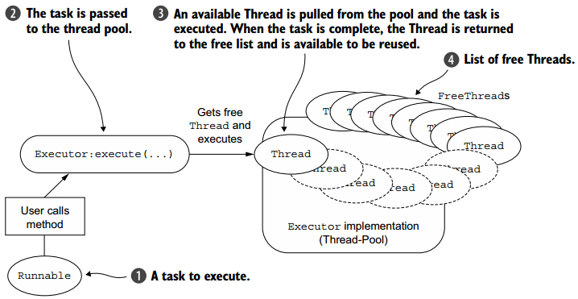
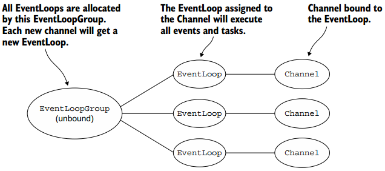

# 参考链接

[朱晔和你聊Spring系列S1E5：Spring WebFlux小探](https://juejin.im/post/5bb6f41ce51d450e6b0e0327)

[响应式Spring的道法术器（Spring WebFlux 快速上手 + 全面介绍）](http://blog.51cto.com/liukang/2090163)

[spring webflux（二）](https://www.jianshu.com/p/dcfc640c16e8)

[Netty 源码分析之 三 我就是大名鼎鼎的 EventLoop(一)](https://segmentfault.com/a/1190000007403873)

[【Netty】EventLoop和线程模型](https://www.cnblogs.com/leesf456/p/6902636.html)

[Netty线程模型及EventLoop详解](https://www.jianshu.com/p/128ddc36e713)

# 常见线程模型

转载自`http://www.cnblogs.com/leesf456/p/6902636.html`

> 线程池可通过缓存和复用已有线程来提高系统性能，基本的缓冲池模式可描述如下：
>
> 　　　　· 从池中空闲链表中选取线程，然后将其分配赋予给已提交的任务。
>
> 　　　　· 当线程完成工作时，该线程又返回至空闲链表，可再进行复用。
>
> 　　该模式如下图所示。
>
> 　　
>
> 池化和复用线程是针对每个任务都需要创建和销毁线程的改进，但还是需要进行上下文切换，并且随着线程数量的增加，其负担也会增加。同时，在高并发下也会出现很多线程问题。

**举例一个常见场景：**

1. 当请求发送到tomcat时，tomcat从线程池获取一个线程分配给该请求。 该线程可能是新建的，也可能是复用已存在的。引入线程池是不想频繁地创建、销毁线程，造成不必要的消耗。
2. 新增线程会增加内存。如果已达最大线程，则后来的请求将无法处理。当线程越多时，CPU进行上下文切换需要更多的开销，这些切换不是在处理业务。
3. 一个请求会在一个线程中执行，spring事务信息存储在ThreadLocal中
4. 请求处理完后，线程返回线程池进行管理

## **内存**

JVM每个线程都需占用内存，可以通过`java -XX:+PrintFlagsFinal -version | grep ThreadStackSize`查看

[JDK7 VM Options说明](https://www.oracle.com/technetwork/java/javase/tech/vmoptions-jsp-140102.html)

[JDK8 VM Options说明](https://docs.oracle.com/javase/8/docs/technotes/tools/windows/java.html)

根据JDK版本及平台会不同，考虑到我们一般都是部署到Linux 64位服务器上，JDK8以上，可以当作JVM一个线程会占用1M内存。

那么线程越多，占用内存就越多。另外线程间不停切换，也耗时。

# Netty EventLoop

转载自`http://www.cnblogs.com/leesf456/p/6902636.html

> 为通道的I/O和事件提供服务的EventLoops包含在EventLoopGroup，EventLoops创建和分配的方式根据传输实现（异步和阻塞）而有所不同。
>
> **· 异步传输**。只使用少量的EventLoopGroup，在当前的模型中其在通道中共享。这允许通道由最小数量的线程提供服务，而不是为每个通道分配一个线程。下图展示了包含三个EventLoop（每个EventLoop由一个线程驱动）的EventLoopGroup，EventLoopGroup创建时会直接分配EventLoops（及其线程），以确保它们在需要时可用，EventLoopGroup负责将EventLoop分配给每个新创建的通道，当前的实现是使用循环方法实现均衡分配，**相同的EventLoop可被分配给多个通道**。
>
> 　　
>
> 　　一旦一个Channel被分配了一个EventLoop，它将在其生命周期中一直使用这个EventLoop（和相关联的线程）。同时请注意EventLoop的分配对ThreadLocal影响，因为一个EventLoop通常驱动多个通道，多个通道的ThreadLocal也相同。
>
> 　　**· 阻塞传输。**OIO的实现与异步传输的实现大不相同，其如下图所示。
>
> 　　
>
> 　　每个通道将会分配一个EventLoop（以及相关线程），Channel的IO事件将由独立的线程处理。

## 其他参考：

[Netty线程模型及EventLoop详解](https://www.jianshu.com/p/128ddc36e713) 这篇文章需要获取转载授权，没有将文章内容复制在此，请自行查阅。

另外还有一个源码分析系列，比较多，也请自行查阅。[Netty 源码分析之 三 我就是大名鼎鼎的 EventLoop(一)](https://segmentfault.com/a/1190000007403873)

大致可以将Netty EventLoop理解为：

1. 

# 响应式编程

**Reactive programming is programming with asynchronous data streams.**

**响应式编程就是与异步数据流交互的编程范式**

搜索响应式编程，可以看到有篇经常被转载的文章，文章是前端的响应式。内容较长，请见链接。

英文原文: [The introduction to Reactive Programming you've been missing](https://gist.github.com/staltz/868e7e9bc2a7b8c1f754)

中文译文：[响应式编程，是明智的选择](https://juejin.im/entry/5a4313ef5188255de57e0a18)  或者搜索`响应式编程`

## 其他参考

[什么是响应式编程——响应式Spring的道法术器](http://blog.51cto.com/liukang/2090170)

[响应式流——响应式Spring的道法术器](http://blog.51cto.com/liukang/2090183)

# 访问

`application.yml`中没有配置端口，使用默认的8080

`http://localhost:8080/test`

`http://localhost:8080/users`

# Spring WebFlux

Spring Boot 2 基于Spring 5。Spring 5 引入了新的响应式框架WebFlux，功能层级与spring-mvc对等。

> Spring reative Web框架，是5.0中的新功能，是一个完全的reactive并且非阻塞的web框架。它适合处理那种event-loop 风格的事情，也就是事件驱动的。它支持Servlet容器（Tomcat，Jetty，Servlet 3.1+），也支持非Servlet的运行时（比如：Netty，Undertow），因为它的基础不是Servlet API，而是构建在Reactive Streams和Reactor项目之上的。

## WebClient

## 与Spring MVC的对比

## 支持的数据库

## 两种方式

controller注解、Router

## 关于性能

[Spring性能说明章节](https://docs.spring.io/spring/docs/current/spring-framework-reference/web-reactive.html#webflux-performance)

> Performance has many characteristics and meanings. Reactive and non-blocking generally do not make applications run faster. They can, in some cases, (for example, if using the `WebClient` to execute remote calls in parallel). On the whole, it requires more work to do things the non-blocking way and that can increase slightly the required processing time.

> The key expected benefit of reactive and non-blocking is the ability to scale with a small, fixed number of threads and less memory. That makes applications more resilient under load, because they scale in a more predictable way. In order to observe those benefits, however, you need to have some latency (including a mix of slow and unpredictable network I/O). That is where the reactive stack begins to show its strengths, and the differences can be dramatic.

## 需注意的地方

1. jdbc还不支持响应式，连接数据库需要额外开线程，或者线程池去获取数据

# 场景

考勤报表功能

1. 获取两个部门的用户
2. 获取这些用户的一个月考勤
3. 考勤生成报表，一个月超过3天，或者有未打卡的特殊着色。着色及统计时，需判断请假
4. 有考勤异常的发送短信

